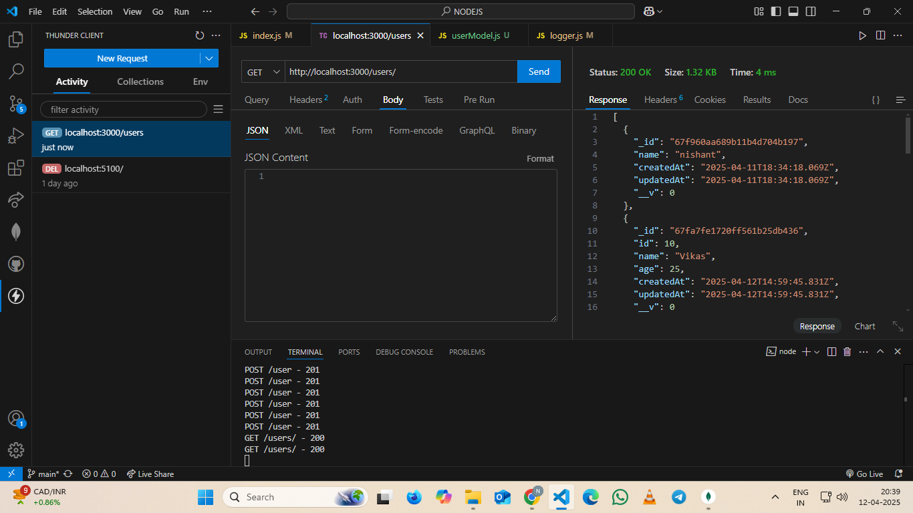
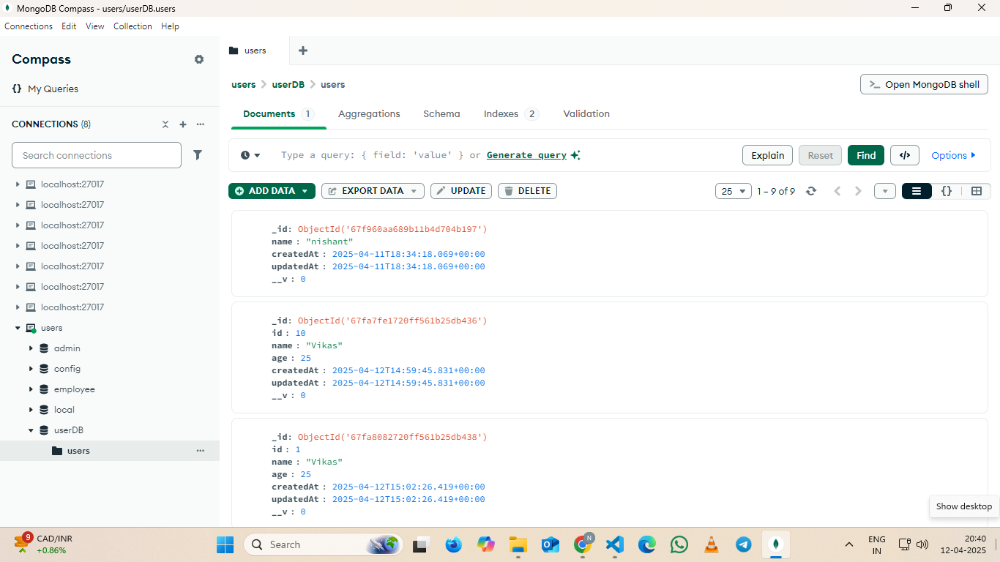
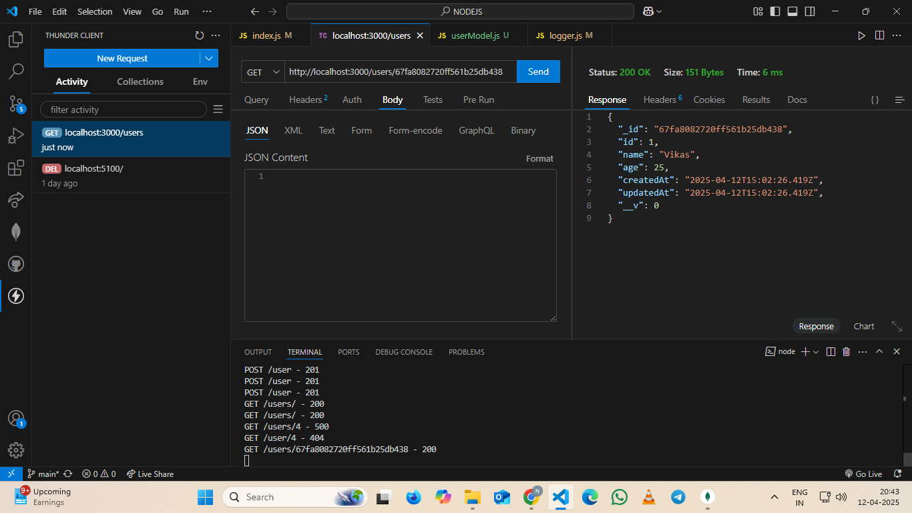
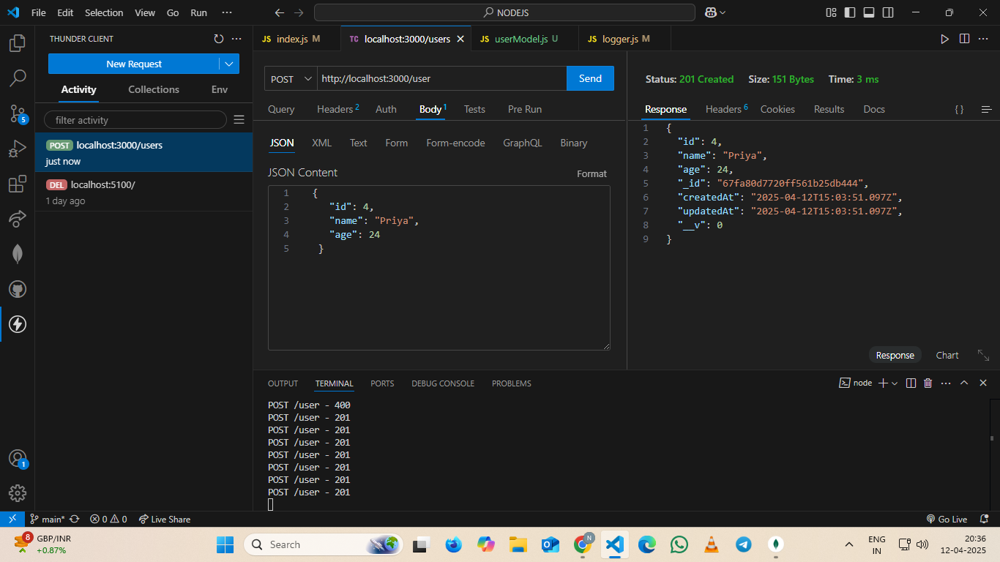
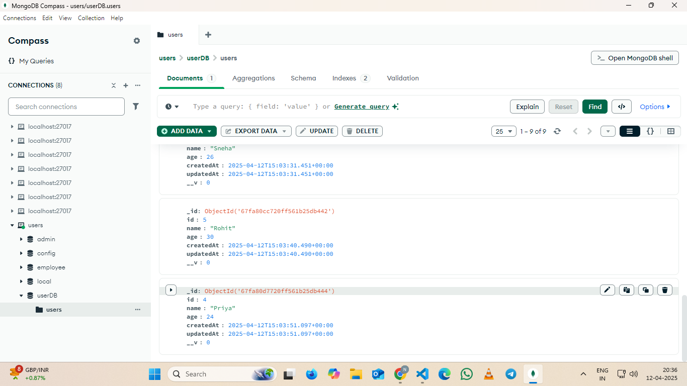
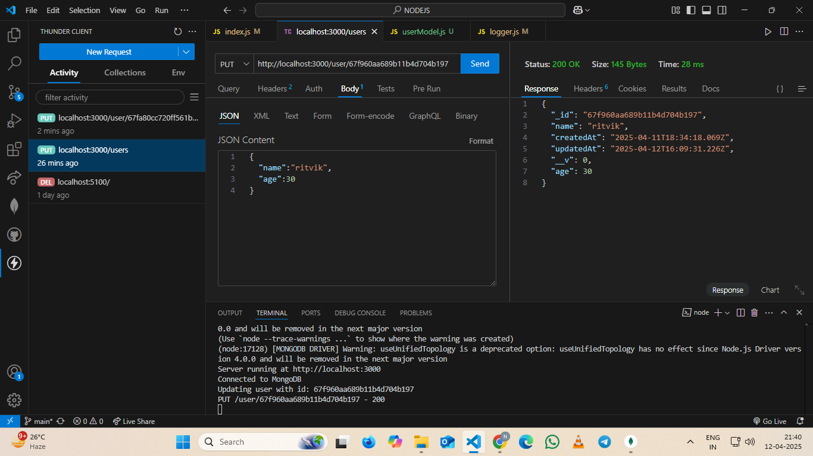
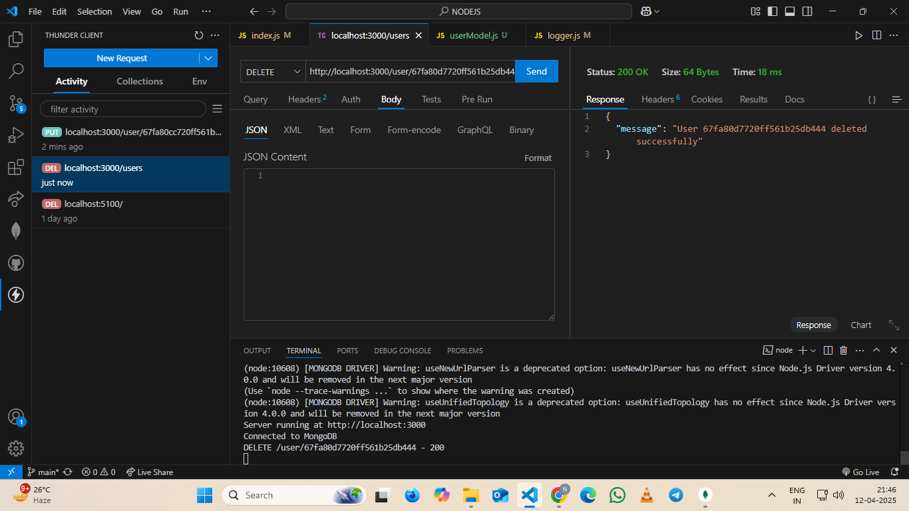
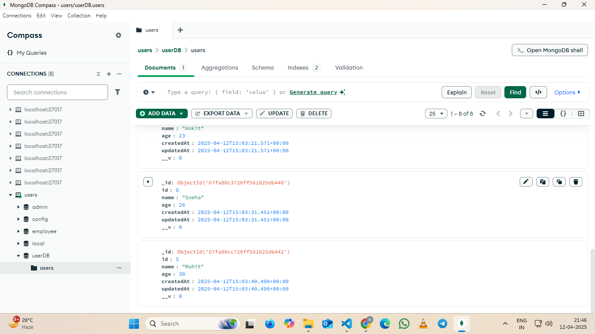

# RESTful API using Node.js, Express.js, and MongoDB

A simple RESTful API built with Node.js, Express.js, and MongoDB for managing user data with basic CRUD operations.

## Prerequisites

- Node.js (v14 or higher)
- npm (Node Package Manager)
- MongoDB (running on localhost:27017)
- Express.js (^5.1.0)
- Mongoose (^8.13.2)

## Installation

1. Clone the repository:
   ```bash
   git clone https://github.com/NISHANT4510/RESTful-API-with-MongoDB-using-Node.js-and-Express.git
   cd RESTful-API-with-MongoDB
   ```

2. Install dependencies:
   ```bash
   npm install
   ```

3. Start the server:
   - For production:
     ```bash
     node index.js
     ```
   - For development with auto-reload:
     ```bash
     npx nodemon index.js
     ```

   The server will run on [http://localhost:3000](http://localhost:3000).

## Database Setup

- Ensure MongoDB is installed and running on your system.
- The application connects to MongoDB at: `mongodb://localhost:27017/userDB`.
- The database `userDB` will be created automatically on the first run.

## API Endpoints

| Method | Endpoint       | Description                  |
|--------|----------------|------------------------------|
| GET    | `/users`       | Fetch all users              |
| GET    | `/users/:id`   | Fetch a specific user by ID  |
| POST   | `/user`        | Create a new user            |
| PUT    | `/user/:id`    | Update an existing user      |
| DELETE | `/user/:id`    | Delete a user                |

## Request Body Format

For POST and PUT requests:

```json
{
  "id": 1,
  "name": "John Doe",
  "age": 25
}
```

## Features

- **Express.js middleware** for request logging.
- **Data validation** for user inputs.
- **Error handling** for invalid requests.
- **MongoDB integration** with Mongoose ODM.
- **Schema-based data modeling** with Mongoose.
- **Consistent error responses**.
- **Automatic MongoDB connection handling**.

## Middleware

The API implements two middleware functions:

1. **Logger**: Logs HTTP method, URL, and status code.
2. **ValidateUser**: Validates required fields (`id`, `name`, `age`) in the request body.

## Response Status Codes

- `200`: Successful request (GET, PUT, DELETE).
- `201`: Resource created successfully (POST).
- `400`: Missing required fields or invalid data format.
- `404`: User not found.
- `500`: Server error.

## Project Structure

```
├── index.js          # Main application file
├── logger.js         # Custom middleware functions
├── models/
│   └── userModel.js  # User model schema
├── package.json      # Project dependencies
├── .gitignore        # Ignored files
└── README.md         # Project documentation
```

## Screenshots

### GET /users - Fetch all users



### GET /users/:id - Fetch single user



### POST /user - Create new user
Request body:
```json
{
  "id": 1,
  "name": "John Doe",
  "age": 25
}
```




### PUT /user/:id - Update user
Request body:
```json
{
  "name": "Jane Doe",
  "age": 26
}
```



### DELETE /user/:id - Delete user



## Technologies Used

- **Node.js**: Runtime environment for executing JavaScript code
- **Express.js**: Web application framework for building REST APIs
- **MongoDB**: NoSQL database for storing user data
- **Mongoose**: MongoDB object modeling tool for Node.js
- **ESM Modules**: Using ES6+ import/export syntax
- **HTTP Status Codes**: Standard response codes for API requests
- **Middleware**: Custom logging and validation middleware
- **Error Handling**: Consistent error handling across the application
- **RESTful Architecture**: Following REST principles for API design
- **JSON**: Data format for request/response handling

## Development Tools

- **VS Code**: Code editor
- **Postman**: API testing tool
- **Git**: Version control
- **npm**: Package management
- **nodemon**: Development server with auto-reload


